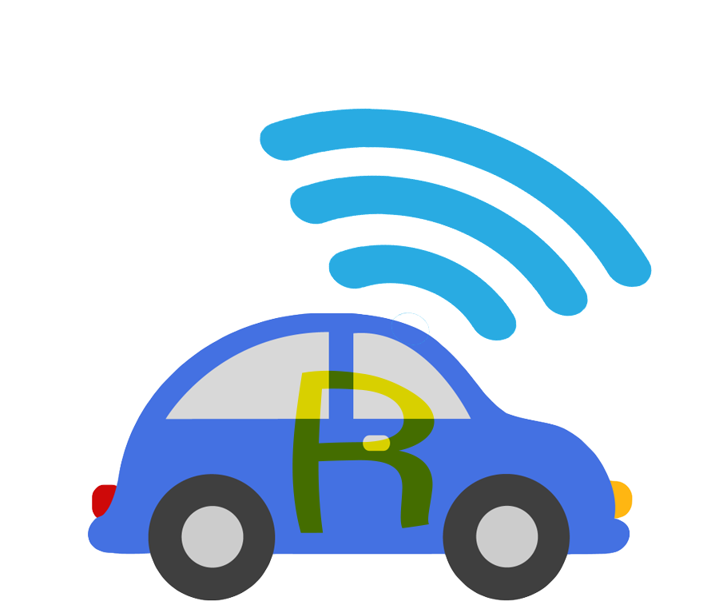
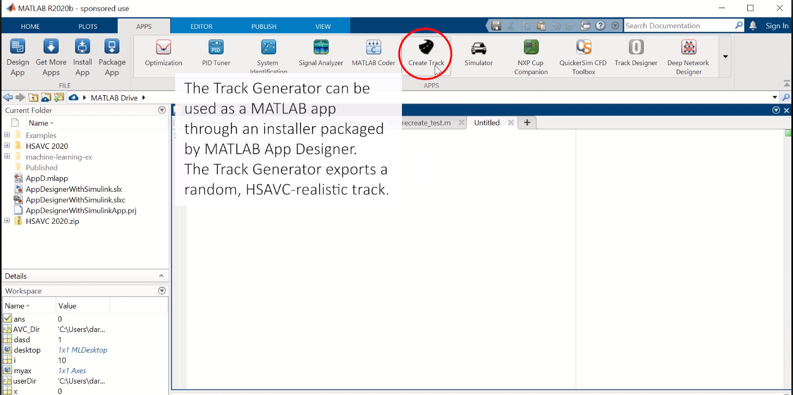
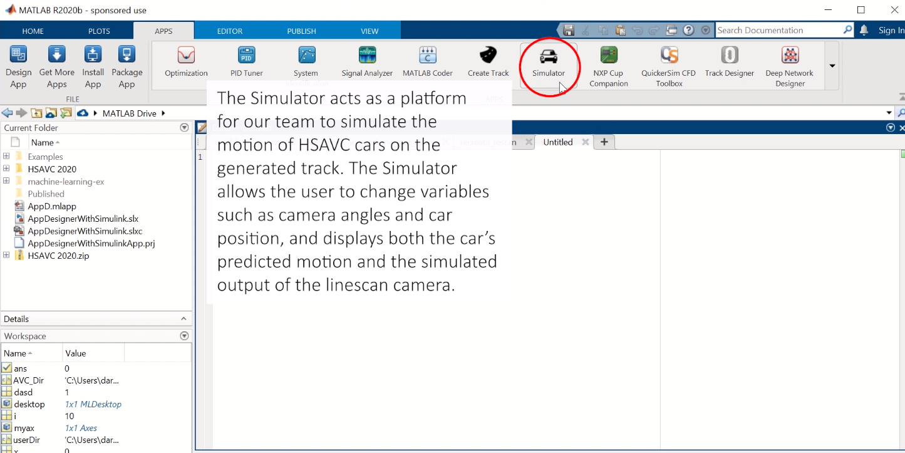

  

<h1 align="center">Autonomous Driving Simulation Patform</h1>

 Matlab Simulator Application for Rose-Hulmann University's High School Autonomous Vehicle Competition.
      

## 🧐 About 

Rose-Hulman University hosts the High School Autonomous Vehicle Competition, a contest for high school students to learn camera-based autonomous driving on random and set tracks. Due to COVID-19, a physical competition is becoming increasingly difficult as many students stay remote and travel is limited. At Eleanor Roosevelt High School, I developed a simulator that allows for the same STEM activity, with the same MATLAB and Simulink challenges, without the physical interaction aspect.

## 🎈 Usage 

Download the two installation files:

[High_School_Autonomous_Vehicle_Competition_Track_Generator.mlappinstall](#usage)
[High_School_Autonomous_Vehicle_Simulator.mlappinstall](#usage)

and run them from the terminal, file explorer, or within MATLAB. They can be accessed from the MATLAB App toolbar.

Track Generator

Simulator

When using the applications, first run the Track Generator and export a track into any directory. Then, import that track from the Simulator and follow the user interface to run the car.
 
 

Please see this video if you'd like to learn more! [https://youtu.be/DM4fKB-0bqc](https://youtu.be/DM4fKB-0bqc)
